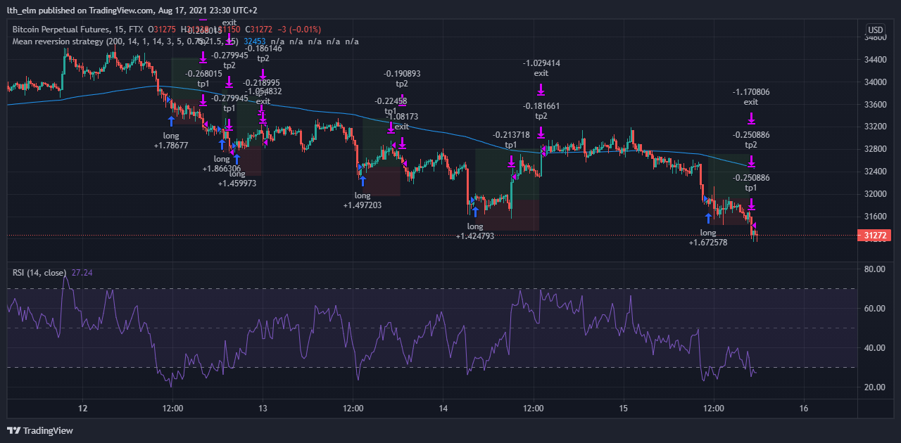
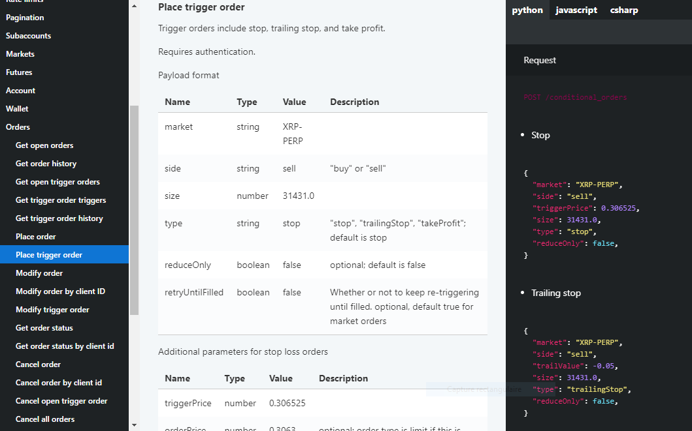
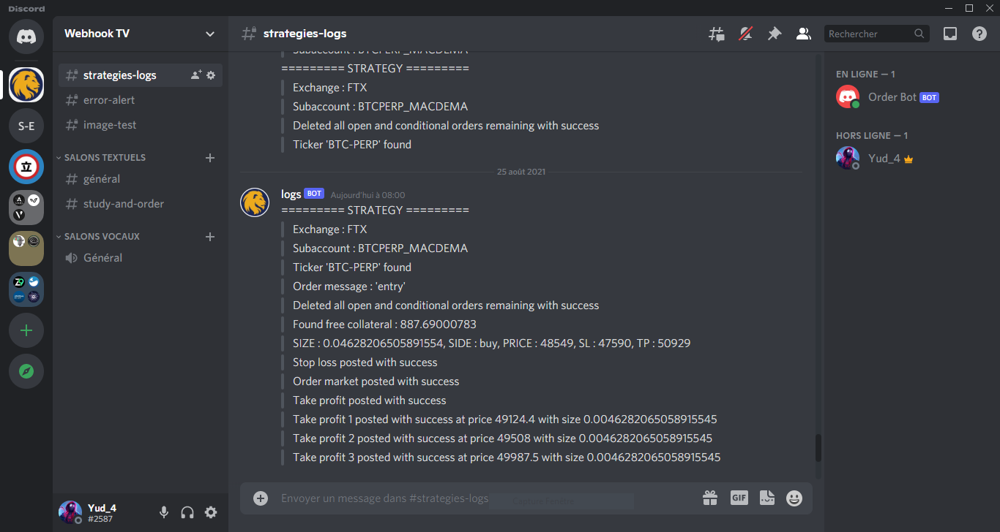
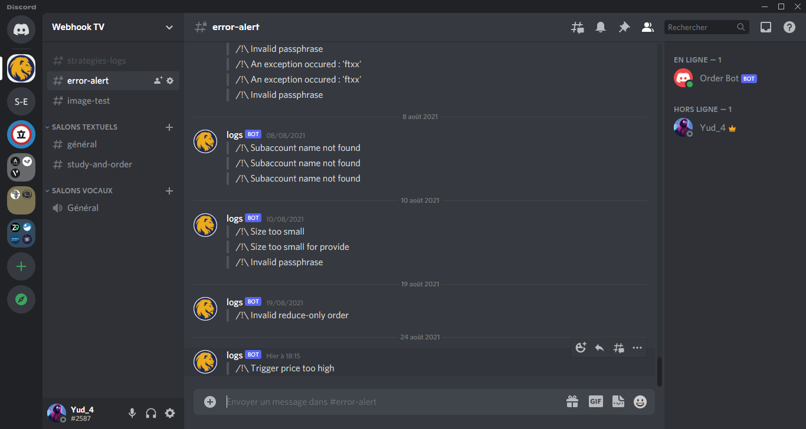

1. [Presentation](#presentation)
2. [TradingView](#tradingview)
    1. [Pinescript Strategy](#pinescriptstrategy)
    2. [Pinescript Alerts](#pinescriptalerts)
3. [The Trading Bot](#tradingbot)
    1. [Main app, Routes and Password](#routespassword)
    2. [Order Initialization](#orderinit)
        1. [Global variables](#globalvariables)
        2. [Exchange and tickers](#exchangetickers)
        3. [Action : Enter, Exit or Breakeven a trade](#action)
    3. [Exchange API](#exchangeapi)
        1. [Trade orders and Payloads](#orderspayloads)
4. [Discord Logs](#discordlogs)
5. [Discord Trading Bot *(coming)*](#discordtradingbot)
6. [Links](#links)

*If you ever decide to sign up to any of the application please use one of my link as we both benefit from it, thank you.*

Also, if you ever notice something that can be improved or corrected or even add a completely new dimension please de not hesitate to **pull request**.


# Presentation <a name="presentation"></a>

**A Flask app receiving alerts from TradingView and automatically sends a POST order to an integrated exchange API such as FTX (Binance and ByBit to come). Can also deliver the alert and the chart to discord where you can decide whether or not to take that trade through a Discord bot.**

In order to build that app I relied on two great videos to get started, implementing and deploying basics stuff, I then enhanced it all for my own use. This one from Part Time Larry https://www.youtube.com/watch?v=XPTb3adEQEE (his [github](https://github.com/hackingthemarkets)) and this one for the discord bot from freeCodeCamp.org : https://www.youtube.com/watch?v=SPTfmiYiuok.

I won't go into full details so if you're a novice you might want to go through the videos first (at least the first one for the first part) but not necessary if you only want to take a grasp of what's happening here, otherwise if you already master even a bit of Flask, APIs, webhooks and TradingView pinescripts you can easily follow along (I will try to add more technical explanations over time or a glossary).


# TradingView <a name="tradingview"></a>

Fist of all, to be able to use TradingView webhooks you will need to subscribe to the pro plan for approximately 12$ per month (a free month trial is available), and you can use my referral link to sign up so we all save 30$ when upgrading to a paid plan : https://www.tradingview.com/gopro/?share_your_love=lth_elm.

## Pinescript Strategy <a name="pinescriptstrategy"></a>

Now that this is done we can get down to business. We will need to write a pinescript strategy that will be for our example focused on **mean reversions** : if we are above/under the 200 period EMA, RSI is overbought/oversold and we have a bearish/bullish engulfing candle we will either short or long the position trying to come back to the 200 period exponential moving average. For ease of use the stop-losses and take-profits are placed using "random" values of ATR.

[Here](pinestrategies/Quick-Mean-Reversion-Strat.pine) is the script that I wrote you can have a look (better copy-paste it on tradingview since the syntax highlighting for pinescripts is not yet integrated on GitHub). I added my own touch so I can visualize the stop-loss and take-profit targets on chart.

*Of course it is far from being perfect so don't use it for you own trading since it wasn't written for this purpose and it's a strategy going against the main trend (thus very risky). **However we will see in part 2 how we can improve it and integrate our own choice thanks to the discord bot.***



As you can see we have multiples exit positions and some are even at breakeven, our integration with the FTX api is compatible for this style of trading, you can set the % you want to close for these intermediary TP in the ```tp_close``` variable. 

However, if you want to keep it to the bottom line you can just set **one entry** and **one fixed exit**. For that you will need to uncomment the ```strategy.exit()``` lines for both ```if goLong``` and ```if goShort``` and remove the two following lines:

```js
// Execute buy or sell order
if goLong and notInTrade
    size = (strategy.equity*risk) / abs(close-long_stop_level)
    strategy.entry("long", strategy.long, qty=size, alert_message="entry")
    // strategy.exit("exit", "long", stop=long_stop_level, limit=long_profit_level, alert_message="exit")
    inLongPosition := true // to remove
    notInTrade := false // to remove
```

And delete all the *multiple TP* category.

```js
// ----- MULTIPLE TP -----
// ...
```

## Pinescript Alerts <a name="pinescriptalerts"></a>

When deciding to take, close or exit a position with **strategy.*entry/close/exit*()** you must specify an **'alert_message'** that can only be one of those : ```entry``` | ```exit``` for the minimal basic strategy, ```tp[n]``` if you've set multiple take profit level and finally ```xxx_breakeven``` anything can be written before the letter 'b' this is just for when this alert is triggered the bot will set a new stop-loss at breakeven level (+ a few % to save comission fees).

___

Now we can set the alert on TradingView. When you do that you will need to specify the Webhook URL that would be https://the-link-of-your-flask-app.com/your-route, "your-route" would be "tradingview-to-webhook-order" in our example ([app.py](app.py)).

```python
@app.route("/tradingview-to-webhook-order", methods=['POST'])
    def tradingview_webhook():
```

Then in 'Message' we write the **payload** in a **json** format so that python can read it and extract the information needed. In [alertmodel.txt](alertmodel.txt) there are multiples formats for alert messages and what results are generated from the **placeholders**, some includes datas for multiple take-profits : ```... "tp Close" : {{plot("TP Close")}}, "tp1 Mult" : {{plot("TP1 Mult")}}, ...``` ==> ```... "tp Close" : 20, "tp1 Mult" : 0.6, ...```. For a basic impletentation the whole payload whould look like this :

```
{
    "ticker" : "{{ticker}}", // BTCUSD...
    "exchange" : "{{exchange}}", // FTX, ByBit, Binance
    "time" : "{{timenow}}",
    "action" : "{{strategy.order.action}}", // buy, sell
    "price" : {{strategy.order.price}},
    "message" : "{{strategy.order.alert_message}}", // entry, exit, ...breakeven
    "short SL" : {{plot("Short SL")}},
    "short TP" : {{plot("Short TP")}},
    "long SL" : {{plot("Long SL")}},
    "long TP" : {{plot("Long TP")}},
    "passphrase" : "abcdefg",
    "subaccount": "Testing"
}
```

* *('//' are only for comments)*.
* In the python code the **tp[n]** multiplicator places an intermediary take profit at ***entering price + |entering price - stop loss price| x tp[n] multiplicator***, you're free to change how you want to use it.
* Some exchanges can have subaccounts so you might need to specify the one to use.
* And finally the passphrase is required since anybody can send a post request to your webhook url so you want to make sure to take into account only those coming from your TradingView alerts.

We will now see how our app checks for the password along all the other implementations.


# The Trading Bot <a name="tradingbot"></a>

## Main app, Routes and Password <a name="routespassword"></a>

As we've said before we need to set a route that will receive **POST requests** and load the request data in a json format, so it will be : 

```python
from flask import request

@app.route("/tradingview-to-webhook-order", methods=['POST'])
    def tradingview_webhook():
        data = json.loads(request.data)
```

Then we will need to compare the stored password with the one we received. So beforehand let's fetch it.

```python
webhook_passphrase_heroku = os.environ.get('WEBHOOK_PASSPHRASE')
webhook_passphrase = webhook_passphrase_heroku if webhook_passphrase_heroku != None else config.WEBHOOK_PASSPHRASE
```

The main password is saved with the Heroku environment variables so we will try to get this one first, however if you are deploying the app locally it won't find it so you will need to write it in the [config.py](config.py) file, otherwise just set it to *None*.

When that's done we can verify that the payload actually contains a password before check if it is the right one and finally calling the ```order()``` function from [orderapi.py](orderapi.py).

```python
import logbot

if 'passphrase' not in data.keys():
    logbot.logs(">>> /!\ No passphrase entered", True)
    return {
        "success": False,
        "message": "no passphrase entered"
    }

if data['passphrase'] != webhook_passphrase:
    logbot.logs(">>> /!\ Invalid passphrase", True)
    return {
        "success": False,
        "message": "invalid passphrase"
    }

orders = order(data)
return orders
```

## Order Initialization <a name="orderinit"></a>

### Global variables <a name="globalvariables"></a>

The **orderapi** python file contains the global variables that we will get : **subaccount** to use, **leverage** to use (or not), maximum **risk per trade** (in %), the **api key** and **api secret**. To retrieve them the concept is the same as with the password except that these values will depend according to the subaccount you are using, therefore right at the beginning of the ```order()``` function we will call ```global_var()``` that will get from the payload the subaccount name and set the values accordingly.

```python
import os, config

subaccount_name = payload['subaccount']
if subaccount_name == 'Testing':
    risk_heroku = os.environ.get('RISK_TESTING')
    risk = risk_heroku if risk_heroku != None else config.RISK_TESTING
    risk = float(risk) / 100
    # ...
elif subaccount_name == 'STRATEGY_TWO':
    # ...
```

### Exchange and tickers <a name="exchangetickers"></a>

In accordance with the **exchange** used in the TradingView strategy ```exchange_api``` will take its class, for now only only the **FTX** have been integrated.

```python
from ftxapi import Ftx
#   SET EXCHANGE CLASS
exchange_api = None
try:
    if exchange == 'FTX':
        exchange_api = Ftx(init_var)
    elif exchange == 'An other exchange name'
    # ...
```

You need to know that the **tickers** names in the exchanges and the ones in TradingView might be different, for instance in tradingview the ticker for the BTC/USD future contract of the FTX exchange is *BTCPERP* while in the FTX app it is *BTC-PERP*. So for that we have created a json file ([tickers.json](tickers.json)) that indexes for every exchange its tradingview ticker with its original one.

```json
{
    "ftx": {
        "BTCPERP": "BTC-PERP",
        "ETHPERP": "ETH-PERP",
        "FTTPERP": "FTT-PERP",
        "BNBPERP": "BNB-PERP"
    }
}
```
And the python code :
```python
#   FIND THE APPROPRIATE TICKER IN DICTIONNARY
ticker = ""
with open('tickers.json') as json_file:
    tickers = json.load(json_file)
    try:
        ticker = tickers[exchange.lower()][payload['ticker']]
```

### Action : Enter, Exit or Breakeven a trade <a name="action"></a>

Finally one important step before making any post request to our exchange is to know what the alert we received was for. This information is contained in the **'message'** key of our payload, remember when we wrote and *'alert_message'* that we used as a placeholder in our pinescript and alert message ? Well it's that one and the message can be of 3 types : ```entry```, ```exit``` and ```xxx_breakeven``` (as long as it finishes with breakeven) and we ignore any other message for information only such as *tp[n]*.

According to the message we will call the appropriate exchange class method.

```python
import logbot
#   ALERT MESSAGE CONDITIONS
if payload['message'] == 'entry':
    logbot.logs(">>> Order message : 'entry'")
    exchange_api.exit_position(ticker)
    orders = exchange_api.entry_position(payload, ticker)
    return orders

elif payload['message'] == 'exit':
    logbot.logs(">>> Order message : 'exit'")
    exit_res = exchange_api.exit_position(ticker)
    return exit_res

elif payload['message'][-9:] == 'breakeven':
    logbot.logs(">>> Order message : 'breakeven'")
    breakeven_res = exchange_api.breakeven(payload, ticker)
    return breakeven_res
```

## Exchange API <a name="exchangeapi"></a>

For this part you'll need to sign up to any exchanges for which the api is integrated and retrieve your private and secret keys. The integration of an exchange api is done by creating a new class on a new file, in this case we will use FTX so for that we have create the file [ftxapi.py](ftxapi.py).

First we initialize the **instances** of the **class** by passing it the previous variables (*subaccount, risk per trade...*) and initiate the REST endpoint URL.

```python
from requests import Request, Session, Response

class Ftx:
    def __init__(self, var: dict):
        self.ENDPOINT = 'https://ftx.com/api/'
        self.session = Session()

        self.subaccount_name = var['subaccount_name']
        self.leverage = var['leverage']
        self.risk = var['risk']
        self.api_key = var['api_key']
        self.api_secret = var['api_secret']
```

The methods unders '*SIGN, POST AND REQUEST*' are obviously for authentication and POST and GET requests. The authentification technique is given by FTX, you can find it here alongside the rest of the **API documentation : https://docs.ftx.com/?python#authentication**

### Trade orders and Payloads <a name="orderspayloads"></a>

Now under '*ORDER FUNCTION*' are written the 3 method class for **entering**, **exiting** a position and even a method that has the ability of moving a stop loss to **breakeven**.

The structure is essentially all the same for the three, we define with variables the **action** (buy or sell), what **quantity** (size), at what **price**, where to place the **tp** and **sl** and we regroup them all in a different dictionnary payloads. Depending on the request we need to specify or not somes values so you need to check what is expected for a specific request in the documention.

*Ok let's suppose that our bot is about to enter in a position, for safety it will first place the stop loss and this is how we code that :*

```python
sl_payload = {
    "market": ticker,
    "side": close_sl_tp_side,
    "triggerPrice": stop_loss,
    "size": size,
    "type": "stop",
    "reduceOnly": True,
    "retryUntilFilled": True
}
r = self._try_request('POST', 'conditional_orders', sl_payload)
if not r['success']:
    return r
orders.append(r['result'])
```

*How can we know that the payload has to be written like that and that the we want to post to the url 'ENDPOINT/conditional_orders' ? Well simply by looking over the documentation :*



*https://docs.ftx.com/?python#place-trigger-order*

By scrolling down the file you can quickly have an idea of all the things that are possible (posting limit orders, multiple take profits etc...). From and exchange class to another you'll probably need to change in these three methods the payloads'keys and values, the urls and how you access a value from a json you've retrieved.


# Discord Logs <a name="discordlogs"></a>

You must have notice in some part of the code lines similare to these ones :

```python
import logbot

logbot.logs(">>> Order message : 'entry'")
# or
logbot.logs(">>> /!\ Invalid passphrase", True)
```

This ```logs()``` function from [logbot.py](logbot.py) act as a console **log printer** but also sends the logs to a discord channel you've specified so that you can easily at any time **track your bot's actions**.



You can create another channel for **error logs** where you would set notifications to high priority so that you will be quickly aware if anything goes wrong.



To do that it's pretty simple, you'll have to send a json post request to the discord webhook *(Discord server settings / Integrations / Webhooks / New webhooks)* which must contain a username, a content and optionally an avatar. If an error has occured you just set the *error* variable to *true* and the message is also send to the error channel.

```python
import requests

DISCORD_ERR_URL = "https://discord.com/api/webhooks/xxxxx"
DISCORD_LOGS_URL = "https://discord.com/api/webhooks/xxxxx"
logs_format = {
	"username": "logs",
	"avatar_url": "https://imgr.search.brave.com/ZYUP1jUoQ5tr1bxChZtL_sJ0LHz7mDhlhkLHxWxhnPM/fit/680/680/no/1/aHR0cHM6Ly9jbGlw/Z3JvdW5kLmNvbS9p/bWFnZXMvZGlzY29y/ZC1ib3QtbG9nby00/LnBuZw",
	"content": ""
}

def logs(message, error=False):
    print(message)
    try:
        json_logs = logs_format
        json_logs['content'] = message
        requests.post(DISCORD_LOGS_URL, json=json_logs)
        if error:
            requests.post(DISCORD_ERR_URL, json=json_logs)
    except:
        pass
```

# Discord Trading Bot <a name="discordtradingbot"></a>


# Links <a name="links"></a>

* TradingView :

https://www.tradingview.com/gopro/?share_your_love=lth_elm for both saving 30$ when upgrading to a paid plan.

* FTX :

https://ftx.com/#a=26368756 and you receive a 5,00 % fee discount on all your trades.

* Binance and Binance future:

https://accounts.binance.com/en/register?ref=MJB86NYU to save 10% comission fee.

https://www.binance.com/en/futures/ref/154947021 for binance future and to also save 10%.